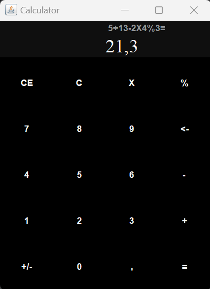

# Calculator

This is a calculator app made in Java. It contains the basic operators and some features like the display of the historic, the negative/positive button or the back/clear/clear all buttons.
## Screenshots




## Badges

[](https://choosealicense.com/licenses/mit/)


## Run App

Download zip file

Go to the project directory in the target folder

```bash
  cd my-project/target
```

Run the jar file

```bash
  java -jar Calculator-1.0-SNAPSHOT.jar
```
## work progress

This project was made in December 2023 during a formation at BeCode.
## Authors

- [@Valentin](https://github.com/Valentin-Lefort)
- And me